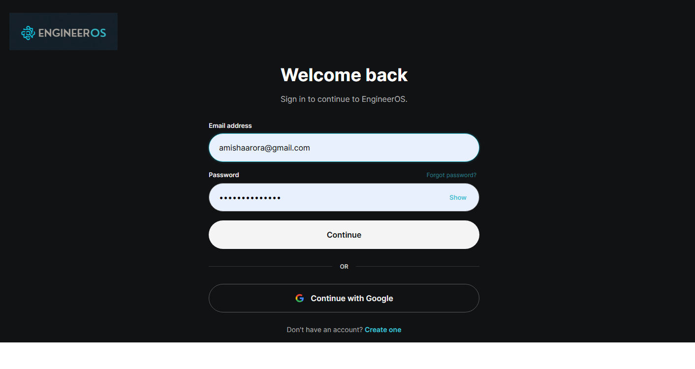
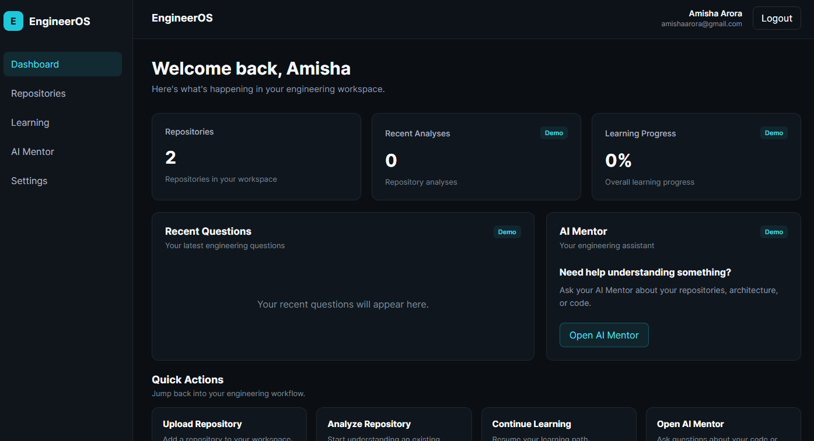
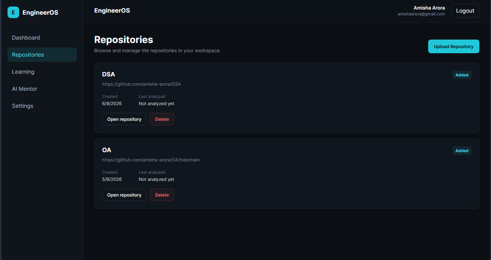
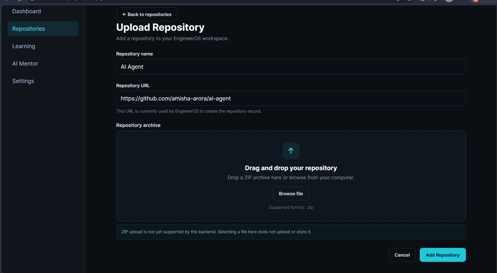
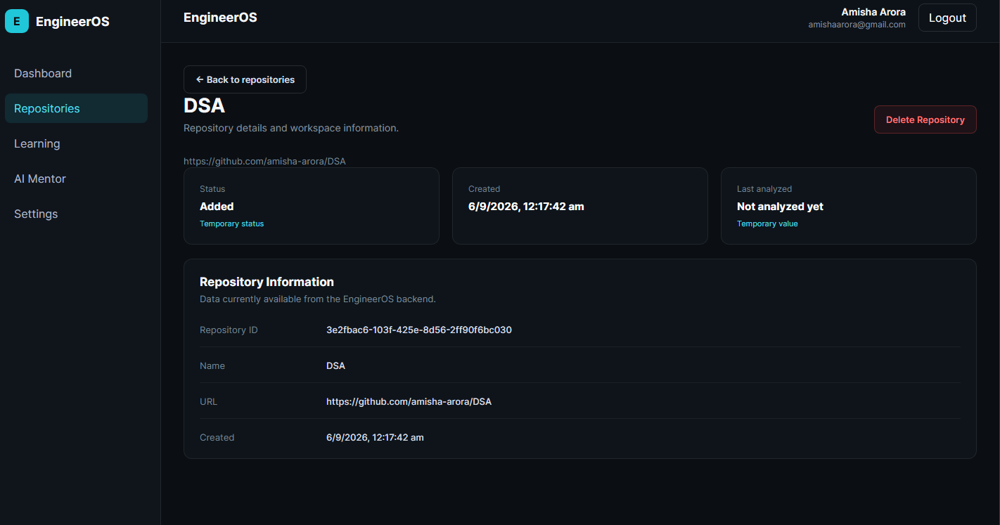
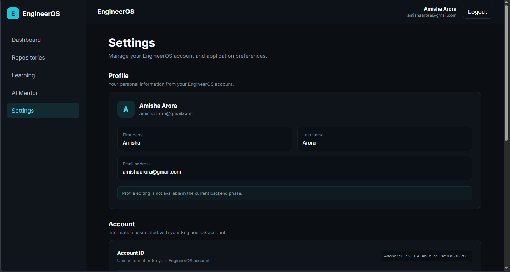

# EngineerOS

EngineerOS is an AI-powered onboarding and engineering workspace designed to help software engineers understand, manage, and eventually analyze software repositories.

The project currently includes a React + TypeScript frontend connected to a secure ASP.NET Core backend using JWT-based authentication and PostgreSQL.

> **Current Status:** Phase 2 completed — Full-stack authentication, repository management, responsive frontend, and frontend/backend integration are functional.

---

## Features

### Authentication

- User registration
- User login
- JWT access-token authentication
- Refresh-token support
- Secure logout
- Protected frontend routes
- Protected backend endpoints
- Session expiration handling

### Repository Management

- Add a repository to the workspace
- View repositories belonging to the authenticated user
- View repository details
- Delete repositories
- Repository ownership validation
- Duplicate repository protection

### Frontend

- Responsive React interface
- Dashboard
- Repository management pages
- Repository upload page
- Repository details page
- Settings page
- Loading states
- API error handling
- Confirmation modal for destructive actions
- Mobile navigation

### Backend

- ASP.NET Core Web API
- Clean Architecture
- Entity Framework Core
- PostgreSQL
- JWT authentication
- Refresh-token management
- Repository ownership authorization
- Global exception handling
- Dependency injection

---

## Tech Stack

### Frontend

- React
- TypeScript
- Vite
- React Router
- CSS

### Backend

- C#
- ASP.NET Core
- Entity Framework Core
- PostgreSQL
- JWT Authentication
- xUnit

### Development Tools

- Git
- GitHub
- Postman
- DBeaver
- Visual Studio

---

## Architecture

EngineerOS follows a Clean Architecture structure on the backend:

```text
EngineerOS.Api
      ↓
EngineerOS.Application
      ↓
EngineerOS.Domain

EngineerOS.Infrastructure
      ↓
Database / Authentication / External Services
```

The goal is to keep business logic independent from infrastructure concerns such as databases and authentication implementations.

More architecture documentation is available in:

```text
docs/ARCHITECTURE.md
docs/API_DESIGN.md
docs/DATABASE_DESIGN.md
```

---

## Project Structure

```text
EngineerOS/
│
├── backend/
│   └── src/
│       ├── EngineerOS.Api
│       ├── EngineerOS.Application
│       ├── EngineerOS.Domain
│       └── EngineerOS.Infrastructure
│
├── frontend/
│
├── docs/
│   ├── ARCHITECTURE.md
│   ├── API_DESIGN.md
│   ├── DATABASE_DESIGN.md
│   ├── PRD.md
│   ├── USER_FLOW.md
│   ├── VISION.md
│   └── SCREENSHOTS/
│
├── diagrams/
│
└── README.md
```

---

# Frontend Setup

EngineerOS uses React, TypeScript, and Vite for the frontend.

## Prerequisites

Make sure you have installed:

- Node.js
- npm
- .NET SDK
- PostgreSQL

The ASP.NET Core backend should also be configured and running before using the frontend.

## Install Frontend Dependencies

From the project root:

```bash
cd frontend
npm install
```

## Configure Environment

Create a `.env` file inside the `frontend` directory.

```env
VITE_API_BASE_URL=http://localhost:5210
```

Change the port if your ASP.NET Core API runs on a different port.

## Run the Frontend

```bash
npm run dev
```

The Vite development server will normally be available at:

```text
http://localhost:5173
```

## Production Build

To verify that the frontend builds successfully:

```bash
npm run build
```

---

# Backend Setup

Navigate to the backend API project.

```bash
cd backend/src/EngineerOS.Api
```

Configure the PostgreSQL connection string and JWT settings using your local development configuration.

Apply EF Core migrations if required, then run:

```bash
dotnet run
```

The frontend expects the backend API to be running before authenticated features can be used.

> Do not commit database passwords, JWT secrets, or other credentials to the repository.

---

# Application Screenshots

## Login



## Dashboard



## Repositories



## Upload Repository



## Repository Details



## Settings



---

# Current Phase

## Phase 2 — Full-Stack Application Foundation

Phase 2 includes:

- Authentication flow
- JWT-based protected APIs
- Refresh tokens
- User session restoration
- Repository CRUD functionality
- Repository ownership protection
- Centralized frontend API communication
- Responsive application layout
- Global API error handling
- Loading and empty states
- Confirmation dialogs
- Frontend/backend integration

Architecture Explorer, semantic search, RAG, repository analysis, and AI Mentor functionality are planned for later phases.

---

# Security

EngineerOS currently implements several foundational security practices:

- Password hashing
- JWT access tokens
- Refresh-token revocation
- Protected API endpoints
- Backend repository ownership checks
- Unique database constraints
- Authentication middleware
- Authorization middleware

Frontend route protection is used for user experience only. The backend remains responsible for authorization and data ownership enforcement.

---

# Roadmap

Future phases are planned to introduce:

- Repository ingestion and analysis
- Architecture Explorer
- Semantic code search
- AI-assisted repository understanding
- RAG-based engineering assistance
- AI Mentor
- Learning and onboarding workflows

See `docs/ROADMAP.md` for the detailed roadmap.

---

# Project Status

**Phase 2: Completed**

EngineerOS currently provides a functional React application connected to a secure ASP.NET Core backend with authentication, repository management, PostgreSQL persistence, responsive layouts, and centralized API communication.
