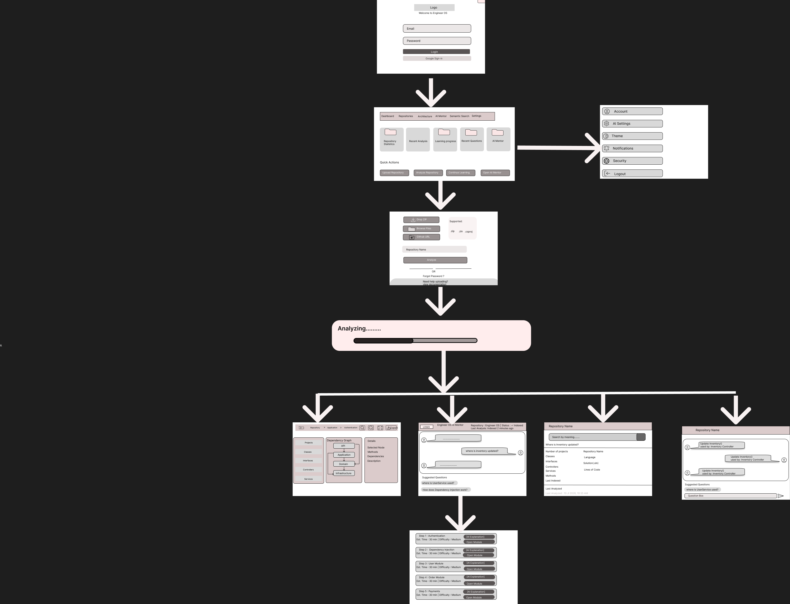

# EngineerOS User Flow

## Overview

This document describes how users navigate through EngineerOS Version 1.

---

## Screen Flow

Login

↓

Dashboard

↓

Repository Upload

↓

Repository Analysis

↓

Repository Indexed

↓

├── Architecture Explorer

├── AI Mentor

├── Repository Details

├── Semantic Search

↓

Learning Roadmap

↓

Question & Answer

---

## Flow Diagram

---

## Screen Descriptions

### Login

Users authenticate using email/password or Google Sign-In.

### Dashboard

Displays repository statistics, recent analyses, learning progress, and quick actions.

### Repository Upload

Users upload a .zip file or provide a GitHub repository URL.

### Repository Analysis

The system analyzes the repository by parsing the solution, extracting metadata, generating embeddings, and indexing the repository.

### Architecture Explorer

Visualizes project structure and dependency relationships.

### AI Mentor

Allows users to ask natural language questions about the repository.

### Repository Details

Displays repository statistics, metadata, and indexing information.

### Semantic Search

Enables users to search repository contents by meaning rather than filenames.

### Learning Roadmap

Generates a personalized learning sequence based on repository structure and complexity.

### Question & Answer

Provides conversational answers using repository context and vector search.
